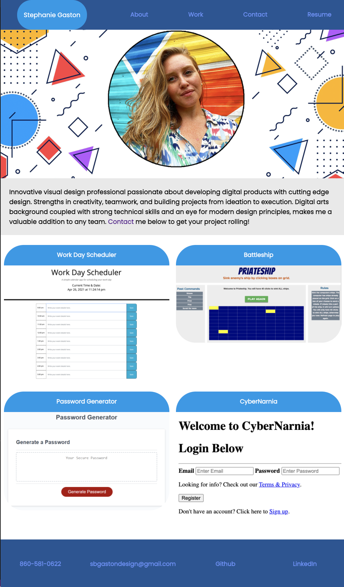
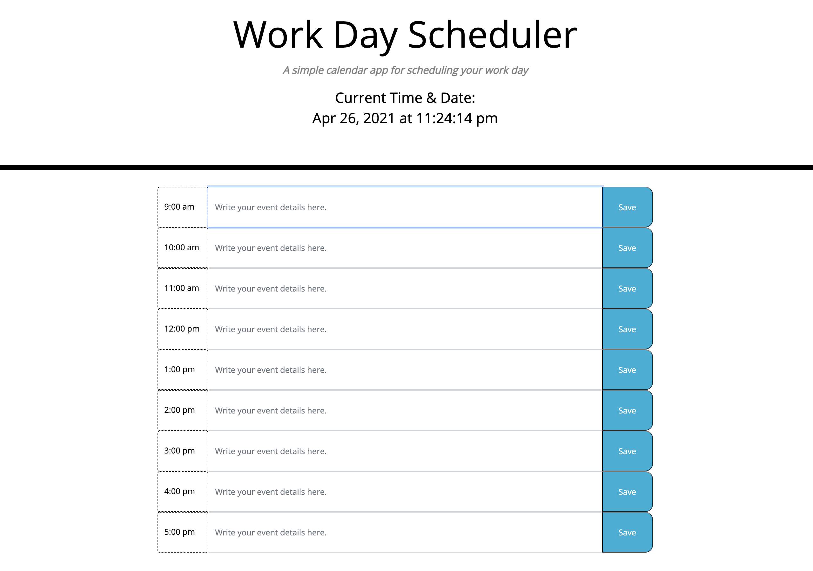
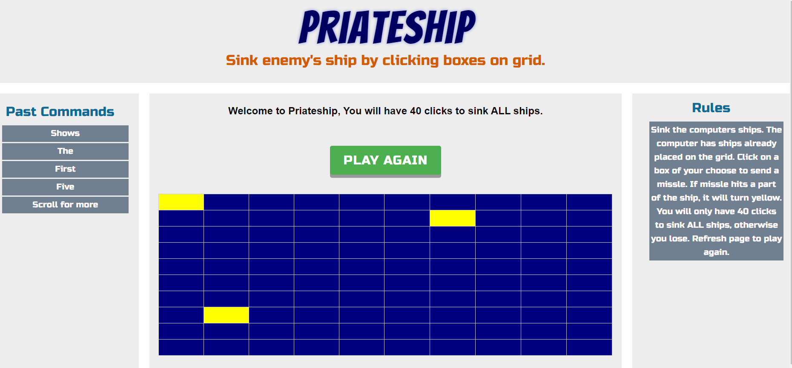
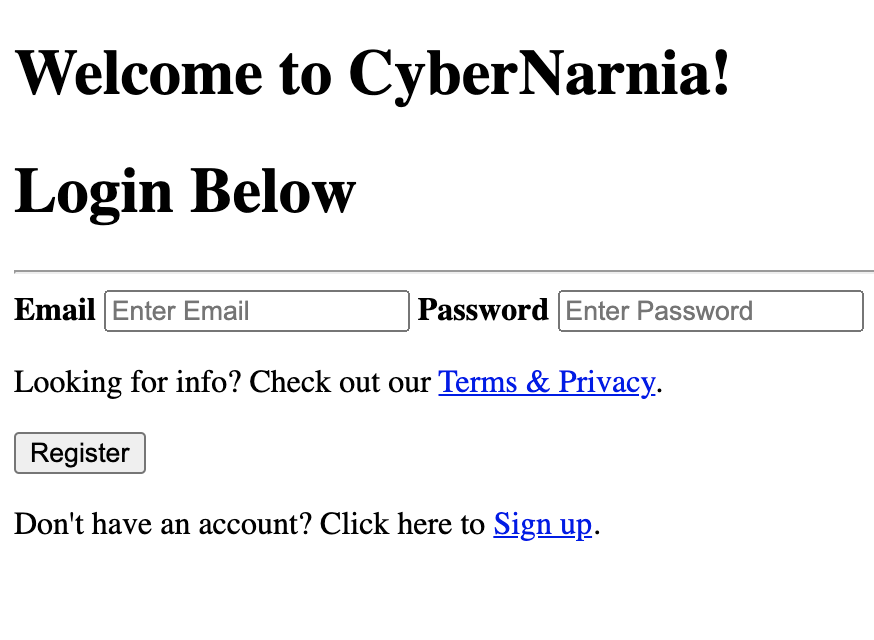

# Portfolio3

A portfolio of current applications with resume and contact info

# Portfolio_Homework_Updated

An updated portfolio now featuring 2 projects and some exemplary homework assignments.

## Goal:

The goal was to update an existing website with current work; including links to download an updated resume, an updated LinkedIn profile, email address and Github profile.

## Issues:

- Mobile responsiveness needs to be re-worked, specifically in the nav and footer.

## Updated Portfolio:

https://sbgastondesign.github.io/Portfolio3/

---

## Products Shown:

#### Work Day Scheduler:

- Description: A Simple calendar application that allows a user to save events for each hour of the work day.
  "https://sbgastondesign.github.io/WorkDayScheduler_Homework_5/"

---

#### Project 1 - Battleship

- Description: Battleships is a remake of the classic pen and pencil game brought to your browser. The game is round-based and can be played in single, or two player mode.
  "https://sbgastondesign.github.io/battleshipproject/"

---

#### Password Generator

- Description: An application that enables employees to generate random passwords based on criteria that they’ve selected.
  
  "https://sbgastondesign.github.io/Java-Homework-3/"

---

#### Project 2 - CyberNarnia

- Description: Our application is the prime piece of technology to store all of your bookish needs! In addition to our expansive search engine and saving function, this application is a fantastic combination to save your book history (past, present, or future!)
  "https://quiet-hollows-63392.herokuapp.com/"

## Table of Contents

If your README is long, add a table of contents to make it easy for users to find what they need.

- [Goal](#Goal)
- [Issues](#Issues)
- [Results](#Results)
- [Contact](#Contact)

---

### License

MIT License, Copyright (c) [2021] [StephanieGaston]

---

### Contact:

- Email: sbgastondesign@gmail.com
- Github: github.com/sbgastondesign
- LinkedIn: "http://www.linkedin.com/stephanie-gaston-1067217a/"
