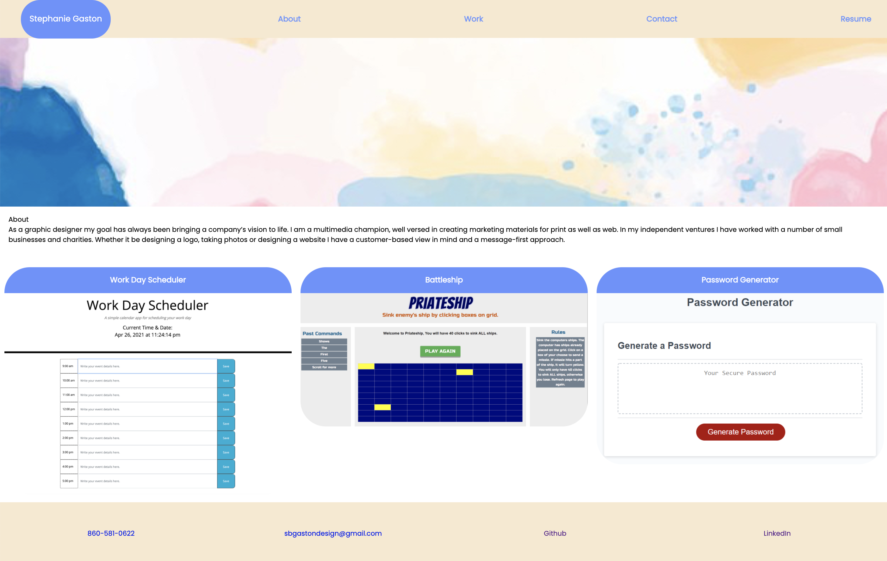

# Portfolio3

A portfolio of current applications with resume and contact info

# Portfolio_Homework_Updated

Assignment 8. An updated portfolio featuring Project 1 and two exemplary homework assignments.

## Goal:

The goal was to update an existing website with current work; including links to download an updated resume, an updated LinkedIn profile and Github profile.

## Issues:

- Headshot would not show up.

## Results:

https://sbgastondesign.github.io/Portfolio_Homework_2/

## Table of Contents

If your README is long, add a table of contents to make it easy for users to find what they need.

- [Goal](#Goal)
- [Issues](#Issues)
- [Results](#Results)

---

### License

MIT License, Copyright (c) [2021] [StephanieGaston]
